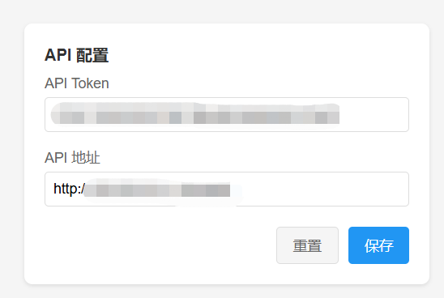

# Translate Extension

一个简单的Chrome/Edge浏览器翻译插件，将输入的文本内容翻译为指定目标语言，只保留世界通行前10的语言。大多翻译插件功能太复杂，本插件旨在保持简洁实用。

## 功能演示

### 翻译界面

简洁的翻译界面，支持中文、英语等常用语言互译

### API配置

配置服务端程序的API Token和服务地址

## 源码说明

项目包含两个主要部分:

### browser-extension
浏览器扩展程序源码，已验证兼容:
- Google Chrome 131.0.6778.109
- Microsoft Edge 131.0.2903.70

### translate-server  
服务端程序，调用火山翻译引擎。

> 注: 使用火山引擎需要注册账号获取服务访问密钥，详见 [火山引擎文档](https://www.volcengine.com/docs/4640/130872)